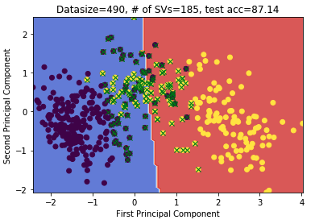
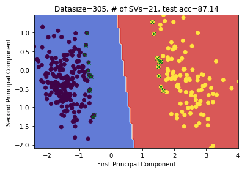
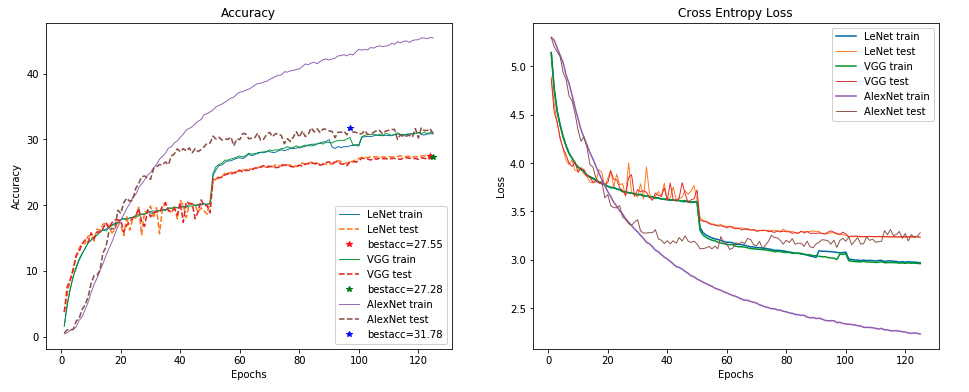

# Machine Learning : Assignment 2

In this assignment the transition from kernel methods (SVMs) to deep learning is shown. We show why there was a need for the transition. The problem statement is given [here](./Assignment_2_409_2020.pdf) and the detailed report [here](./Report.pdf).

## Kernel Machines

Support vector machines are used with different kernels to solve a binary classification problem. Here an interesting insight from the report is presented. Remaining results are given in the report. The scripts (made from scratch) can be found [here](./Scripts/SVM.ipynb).

**Importance of Support Vectors**: The decision boundary is visualized after dimensionality reduction using PCA.

Now, after removing the support vectors (marked with green cross) from the training dataset, the boundary is again visualised:

We can see that the boundary remains nearly unchanged suggesting that most of the original support vectors in the trainset were the points causing **margin error**, and thus removing them the optimal margin remains nearly same.

## Neural Networks

A fully-connected neural network is implemented from scratch (in python) [[**MLP**](./Scripts/NeuralNetworks1.ipynb)]. Also, various CNN models with different optimizers are also implemented (in pytorch) [[**CNN**](./Scripts/NeuralNetworks2.ipynb)].

 

## Domain Adaption and Few-Shot Learning

We also solve the problem of learning from sckewed dataset using appropriately designed loss function. Lastly the report also contains results of solving the problem of domain adaption and zero-shot learning. The scripts can be found in [skewed_scripts](./Scripts/Learning_1.ipynb) and [domain_shot_scripts](./Scripts/Learning_2.ipynb).